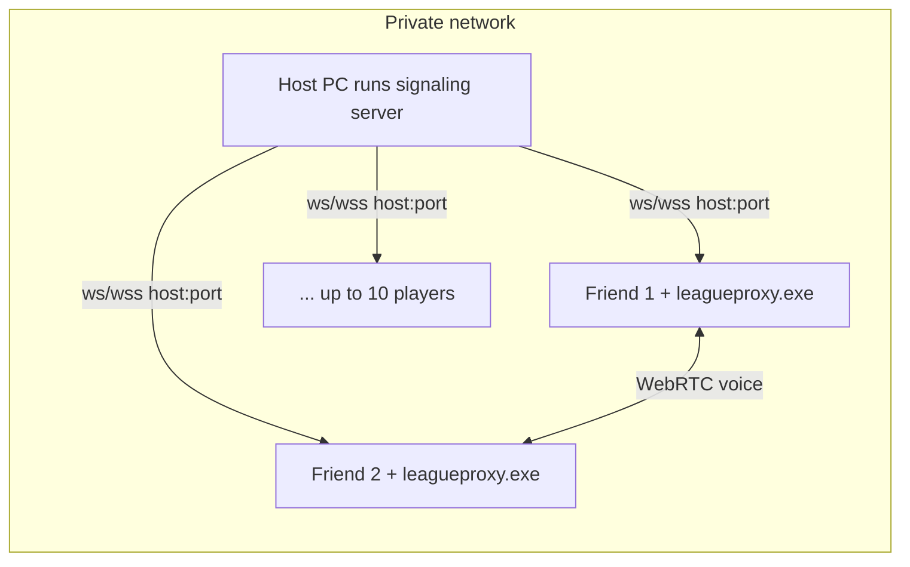

# LeagueProxy — Friend Group Setup

Proximity voice for custom 5v5 games. Hear **nearby** teammates and enemies — allies fade by distance like enemies (always on).

## Safety rules

- **Custom games with our group only** — not ranked, not random queue
- Download the exe **only** from [GitHub Releases](https://github.com/Sandrochkhaidzee/LeagueCustomProxy/releases) or our Discord pin
- Verify the SHA-256 hash before first launch (posted with each release)
- League must be in **Borderless** window mode (Settings → Video)
- Do not use in Korea (Riot LCU restrictions)

## Current release

```
Files:   leagueproxy.exe (players), server.exe (host)
Version: 2.0.0
Server:  Host runs server.exe; players connect on launch (Disconnect to change host)
```

SHA-256 is posted on each [GitHub Release](https://github.com/Sandrochkhaidzee/LeagueCustomProxy/releases).

## One-time setup (each player)

1. Windows 10/11 with WebView2 (ships with Windows 11)
2. Download **`leagueproxy.exe`** from GitHub Releases
3. Verify hash in PowerShell:
   ```powershell
   Get-FileHash .\leagueproxy.exe -Algorithm SHA256
   ```
4. First launch: SmartScreen may warn — **More info → Run anyway** (unsigned hobby build)
5. Allow microphone access when prompted
6. **Each launch:** enter protocol, host IP, and port on the connect screen and click **Connect**

## Every game night

1. Set League to **Borderless** mode
2. Launch **`leagueproxy.exe`** — enter protocol, host IP, and port → **Connect**
3. All 10 players do the same before or during champ select
4. Host creates custom game and invites everyone
5. Once in match, the panel docks beside the minimap — peers appear within seconds
6. Talk normally:
   - **LIVE** / **IDLE** = voice detected vs silent (Voice Activation default)
   - Collapse chevron (left of Settings) shrinks the panel to a header bar
   - Per-row **MUTE** for individual players
   - Default input mode is **Voice Activation** (speak to transmit)

## Host setup (recommended — no VPS needed)

A **private network** (LAN, VPN, or similar) lets one friend host the signaling server at home without paying for a VPS. Players connect using the host’s **protocol, IP, and port**.



### What the network does vs. the app

| | Private network / VPN | leagueproxy.exe |
|--|----------------------|-----------------|
| Reachable IP between friends | Yes | No |
| Match room + proximity volume math | No | Needs signaling server |
| Voice audio | No | WebRTC between players |
| Position tracking | No | Minimap CV on each PC |

### Setup (one-time)

**1. Pick a network everyone can join**

Use a LAN, a VPN your group already uses, or any setup where every player can reach the host’s IP.

**2. Host runs the signaling server** (pick one friend with a stable PC — usually you)

Download **`server.exe`** from the same GitHub release as `leagueproxy.exe`. Enter **protocol**, **host IP**, and **port**, then click **Start server** and **Copy URL**.

Alternatively (developers / manual):

```bat
scripts\start-server.bat
```

**3. Note the host’s IP**

Use the address friends will use to reach the host on your network (e.g. a VPN or LAN IP).

**4. Share connection details with friends**

Host copies the URL from **Copy URL** (e.g. `http://192.168.1.10:3100`). Friends enter **protocol**, **host IP**, and **port** when the app launches, or after **Disconnect** to switch hosts.

**5. Windows Firewall** on the host: allow inbound traffic on the **TCP port** you chose.

### Every game night

1. Host runs **`server.exe`** and clicks **Start server**
2. Everyone launches `leagueproxy.exe`, enters the host’s protocol/IP/port, and connects
3. Play custom 5v5 as usual

### Why self-hosting works well

- **No VPS cost** — server runs on your PC
- **Private** — only people who can reach your IP join; you control position data
- **Better voice** — WebRTC often connects **directly** on LAN/VPN without internet TURN relay

### If you skip self-hosting

Everyone still needs the host’s **protocol, IP, and port** — there is **no default** in the exe. The host shares connection details each game night; friends enter them when the app starts.

## Troubleshooting

| Problem | Fix |
|---------|-----|
| Panel doesn't appear | Launch app before/during match; check League is running |
| No peers in list | All players need the app running; wait ~10 seconds after load-in |
| Overlay missing | Switch League to **Borderless** (not Fullscreen) |
| No voice | Check mic permissions; confirm peers show in panel |
| Can't reach server | Host running **server.exe**? Correct protocol/IP/port? Firewall allows the TCP port? |
| Vanguard concern | App uses Riot-approved APIs only — no memory reads or injection |

## Build location (host only)

Distribute: `release\leagueproxy.exe` + `release\server.exe`, or GitHub Releases.

Rebuild client: `scripts\build-client.bat`. Rebuild host: `scripts\build-server.bat`.

In-app **Check for Updates** pulls the matching exe (`leagueproxy.exe` or `server.exe`) from [GitHub Releases](https://github.com/Sandrochkhaidzee/LeagueCustomProxy/releases).
