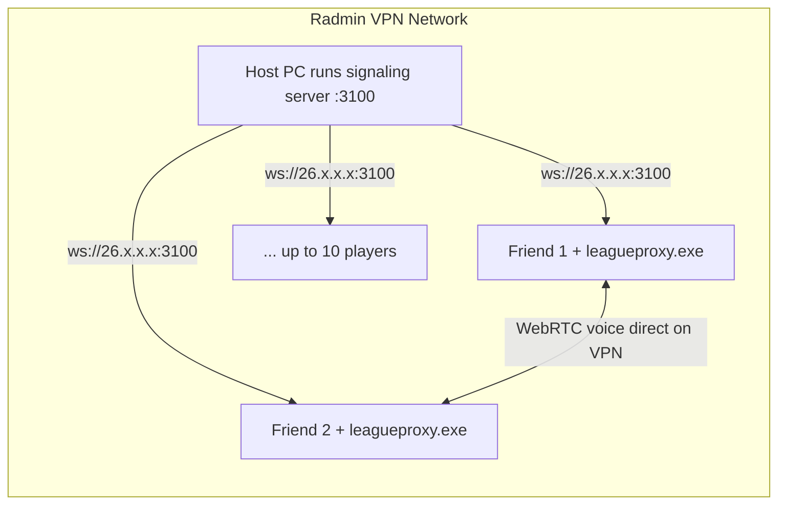

# LeagueProxy — Friend Group Setup

Proximity voice for custom 5v5 games. Hear teammates at full volume; enemies only when close on the map.

## Safety rules

- **Custom games with our group only** — not ranked, not random queue
- Download the exe **only** from [GitHub Releases](https://github.com/Sandrochkhaidzee/LeagueCustomProxy/releases) or our Discord pin
- Verify the SHA-256 hash before first launch (posted with each release)
- League must be in **Borderless** window mode (Settings → Video)
- Do not use in Korea (Riot LCU restrictions)

## Current release

```
File:    leagueproxy.exe
Version: 1.0.0
Server:  http://26.36.227.156:3100 (Radmin — host runs start-server.bat)
```

SHA-256 is posted on each [GitHub Release](https://github.com/Sandrochkhaidzee/LeagueCustomProxy/releases).

## One-time setup (each player)

1. Windows 10/11 with WebView2 (ships with Windows 11)
2. Download **`leagueproxy.exe`** from GitHub Releases
3. Verify hash in PowerShell:
   ```powershell
   Get-FileHash .\leagueproxy.exe -Algorithm SHA256
   ```
4. First launch: SmartScreen may warn — **More info → Run anyway** (unsigned hobby build)
5. Allow microphone access when prompted

## Every game night

1. Set League to **Borderless** mode
2. All 10 players launch **`leagueproxy.exe`** before or during champ select
3. Host creates custom game and invites everyone
4. Once in match, the panel docks beside the minimap — peers appear within seconds
5. Talk normally:
   - **MIC** = self-mute
   - **VOL** = mute everyone
   - Per-row mute for individual players
   - Default input mode is **Voice Activation** (speak to transmit)

## Radmin VPN setup (recommended for friends — no VPS needed)

Radmin VPN gives your group a **private virtual LAN** (e.g. `26.x.x.x` addresses). It does **not** replace the proximity chat app or the signaling server — but it lets **one friend host the server at home** without paying for a VPS or opening router ports.



### What Radmin VPN does vs. does not do

| | Radmin VPN | leagueproxy.exe |
|--|------------|-----------------|
| Private network between friends | Yes | No |
| Match room + proximity volume math | No | Needs signaling server |
| Voice audio | No | WebRTC between players |
| Position tracking | No | Minimap CV on each PC |

### Setup (one-time)

**1. Create a Radmin network** (you as admin)

- Install [Radmin VPN](https://www.radmin-vpn.com/) on your PC
- Create a network → share name + password with friends
- Everyone installs Radmin VPN and joins the same network

**2. Host runs the signaling server** (pick one friend with a stable PC — usually you)

```bat
scripts\start-server.bat
```

Or manually:

```powershell
cd server
npm install
npm run build
$env:PORT=3100; npm start
```

**3. Note the host's Radmin IP**

In Radmin VPN, click your network → find your IP (looks like `26.12.34.56`).

**4. Rebuild the client pointed at the VPN host** (host only)

Edit `.env`:

```
PROXCHAT_SERVER=http://YOUR_RADMIN_IP:3100
```

Rebuild with `scripts\build-client.bat` and distribute the new exe to all friends — or publish a GitHub release.

**5. Windows Firewall** on the host: allow inbound **TCP port 3100** (Node signaling server).

### Every game night with Radmin

1. Everyone connects to the **Radmin VPN network** first
2. Host starts the signaling server (`scripts\start-server.bat`)
3. Everyone launches `leagueproxy.exe` and plays custom 5v5 as usual

### Why this is a good fit

- **No VPS cost** — server runs on your PC
- **Private** — only VPN members can reach your server; you control position data
- **Better voice** — WebRTC often connects **directly over Radmin IPs**, no internet TURN relay needed

### If you skip self-hosting

This build uses the host server at **`http://26.36.227.156:3100`** (Radmin). The host must run `start-server.bat` during every session.

## Troubleshooting

| Problem | Fix |
|---------|-----|
| Panel doesn't appear | Launch app before/during match; check League is running |
| No peers in list | All players need the app running; wait ~10 seconds after load-in |
| Overlay missing | Switch League to **Borderless** (not Fullscreen) |
| No voice | Check mic permissions; confirm peers show in panel |
| Can't reach server on Radmin | Host running `start-server.bat`? Firewall allows port 3100? Everyone on same Radmin network? |
| Vanguard concern | App uses Riot-approved APIs only — no memory reads or injection |

## Build location (host only)

Distribute: `release\leagueproxy.exe` or GitHub Releases.

Rebuild: `scripts\build-client.bat`. In-app **Check for Updates** pulls from [GitHub Releases](https://github.com/Sandrochkhaidzee/LeagueCustomProxy/releases).
